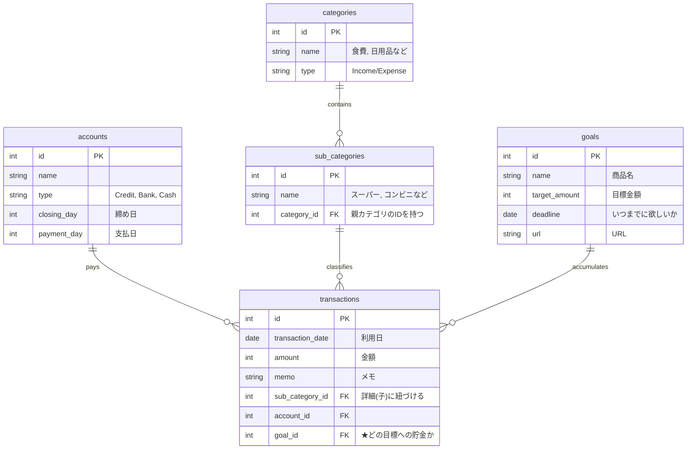

```mermaid
erDiagram
    %% 取引記録（メインテーブル）
    transactions {
        int id PK
        date transaction_date "利用日"
        int amount "金額"
        string memo "メモ"
        int sub_category_id FK "詳細(子)に紐づける"
        int account_id FK
        int goal_id FK "★どの目標への貯金か"
    }

    %% 支払い方法
    accounts {
        int id PK
        string name
        string type "Credit, Bank, Cash"
        int closing_day "締め日"
        int payment_day "支払日"
    }

    %% 大カテゴリ（親）
    categories {
        int id PK
        string name "食費, 日用品など"
        string type "Income/Expense"
    }

    %% 小カテゴリ（子）
    sub_categories {
        int id PK
        string name "スーパー, コンビニなど"
        int category_id FK "親カテゴリのIDを持つ"
    }

    %% 目標管理
    goals {
        int id PK
        string name "商品名"
        int target_amount "目標金額"
        date deadline "いつまでに欲しいか"
        string url "URL"
    }

    %% --- リレーション定義 ---

    %% 1つの口座で、たくさんの取引をする
    accounts ||--o{ transactions : "pays"

    %% 1つの小カテゴリには、たくさんの取引がある
    sub_categories ||--o{ transactions : "classifies"

    %% 1つの大カテゴリには、たくさんの小カテゴリがある
    categories ||--o{ sub_categories : "contains"

    %% 目標と取引を紐づける
    goals ||--o{ transactions : "accumulates"
```
